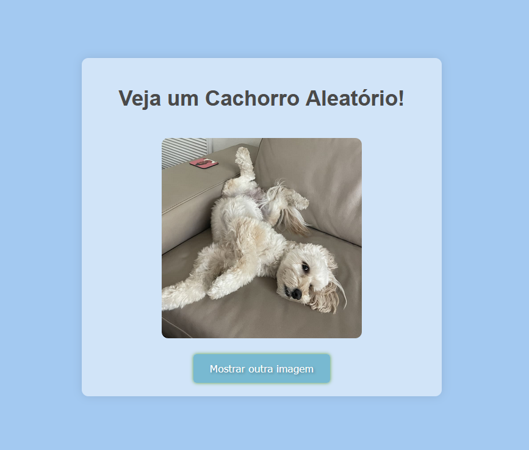

Crie uma lógica para que ao pressionar o botão aconteça uma requisição para uma API pública e que carrega uma imagem aleatória de um cachorro
Documentação da API: https://dog.ceo/dog-api/
Endereço da API que retorna uma imagem: https://dog.ceo/api/breeds/image/random
Com a imagem recebida, mostre a imagem na tela
Desafio extra: faça com que ao entrar na página uma imagem de cachorro já seja mostrada sem a necessidade de pressionar o botão
